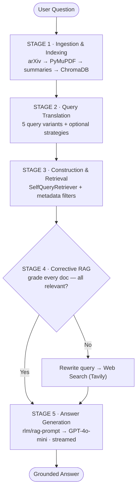
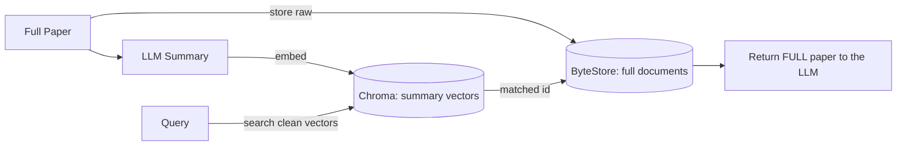
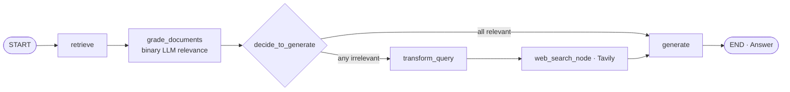
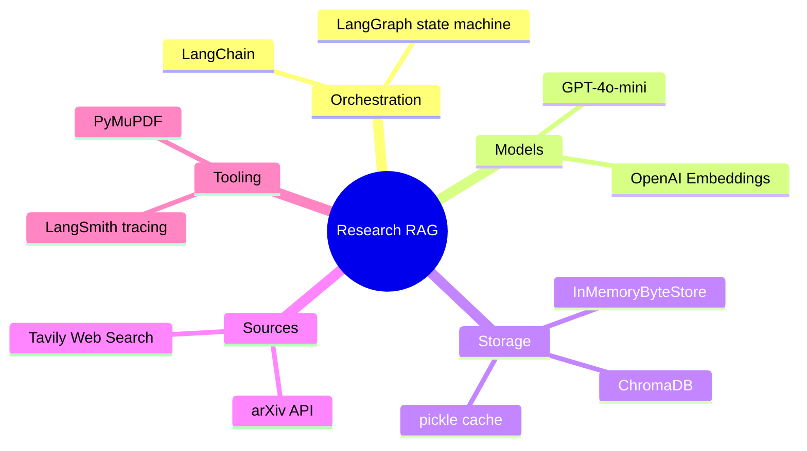

<!-- _class: invert lead -->

# Research **RAG**

### A self-correcting RAG system that searches arXiv — and checks its own work before answering.

`LangChain` · `LangGraph` · `ChromaDB` · `GPT-4o-mini` · `Tavily` · `PyMuPDF`

<small>Built by mpeshwe · namanmawandia</small>

---

## The Problem

**Naive RAG answers confidently wrong.**

The standard recipe everyone ships:
1. Embed the query → 2. Grab nearest chunks → 3. Generate

It breaks the moment retrieval returns something **irrelevant** — the model answers anyway, with full confidence.

> Three failure modes
> - **Vocabulary mismatch** — one phrasing ≠ all phrasings of an idea
> - **No structure** — "papers under 50k words" isn't a similarity search
> - **No fallback** — if the corpus lacks the answer, it hallucinates

*The magic isn't a bigger model — it's giving the system a way to know when it's wrong.*

---

## What is Research RAG?

A modular RAG system that intelligently searches and retrieves **arXiv research papers** using advanced query techniques + a corrective feedback loop.

| | |
|---|---|
| **Multi-angle queries** | 5 variants + RAG Fusion, HyDE, Step-Back, Decomposition |
| **Structured filtering** | LLM → metadata filters: year, authors, word count |
| **Self-correction** | Grades its own retrievals; rewrites + web-searches on gaps |

**5** stage pipeline · **6** RAG strategies · **1** LangGraph feedback loop

---

## The 5-stage pipeline

---

## STAGE 1 · Ingestion & Indexing

- **Download** papers from arXiv across 6 categories
  `cs.LG · stat.ML · cs.AI · cs.CL · cs.RO · cs.CR`
- **Extract** full text + metadata via **PyMuPDF**
- **Summarize** each paper with GPT-4o-mini
- **Index** summaries into **ChromaDB**
- **Cache** docs + summaries to disk (pickle)

> **Why cache?** Embedding + summarizing is the expensive step. `documents_cache.pkl` + `summaries.pkl` mean you pay the OpenAI cost *once* — subsequent runs load instantly.

*Files: `docDownload.py`, `indexing.py`*

---

## STAGE 1 deep dive · Summary-based indexing

Embed something small & clean — return the full thing.

Best of both worlds: **precise retrieval** on tight summaries, **rich context** from full documents. *(MultiVectorRetriever)*

---

## STAGE 2 · Query Translation

One query is limiting. Generate **5 semantically diverse variants** to beat vocabulary mismatch — plus a toolbox for harder questions.

| Technique | Best for |
|---|---|
| **Multi-Query** *(default)* | General use — 5 angles on one question |
| **RAG Fusion (RRF)** | Re-ranking across multiple queries |
| **Decomposition** | Complex, multi-part questions |
| **Step-Back** | Abstract / conceptual questions |
| **HyDE** | Sparse or highly technical corpora |

*File: `QueryTranslation.py`*

---

## STAGE 3 · Query Construction & Retrieval

The **SelfQueryRetriever** reads plain English and builds **structured metadata filters** automatically.

- Filter by `title`, `authors`, `published_year`, `word_count`
- `enable_limit=True` → LLM decides how many docs to pull
- `fix_invalid=True` → auto-recovers from bad filters
- Deduplicate by title across all 5 queries

> "…under 50,000 words" → a real filter: `word_count < 50000`
> A pure similarity search can't honor that.

*File: `QueryConstruction.py`*

---

## STAGE 4 · Corrective RAG — a LangGraph loop

Every doc gets a **yes/no relevance grade**. If anything's off, the graph **rewrites the query** and **falls back to web search** before generating. A real feedback loop — not a one-shot pipeline.

*Files: `CRAG.py`, `graphCrag.py`*

---

## STAGE 5 · Answer Generation

- Final docs + question → `rlm/rag-prompt` (LangChain Hub)
- Generated with **GPT-4o-mini**
- Streamed **node-by-node** via `app.stream()`
- Context kept under a **token budget** (3,500 chars)

> **Grounded by design** — the answer is built only from documents that *passed grading*, or fresh web results when the corpus came up short. Far less room to hallucinate.

---

## Tech stack

---

## A query, start to finish

> "What are the most influential papers on reinforcement learning with words less than 50,000?"

1. Generate 5 variants on "influential RL papers"
2. Self-query adds filter `word_count < 50000`
3. Retrieve top matches per query, dedup by title
4. CRAG grades each doc for RL relevance
5. If gaps → rewrite + Tavily web search
6. Stream a grounded, cited answer

---

## Takeaways

- **Retrieval > prompts** — a grading + correction loop beat every prompt tweak
- **Index summaries** — search tight summaries, return full docs
- **Let the LLM filter** — self-query unlocks structured questions
- **Graphs > chains** — LangGraph makes self-correcting flows clean & observable
- **Cache aggressively** — pickling turned costly rebuilds into instant reloads
- **Always have a fallback** — web search means "not in corpus" ≠ "hallucinate"

---

<!-- _class: invert lead -->

# Know when you're **wrong.**

Research RAG — modular, self-correcting retrieval over academic papers.

⭐ **github.com/mpeshwe/research-rag**

<small>Inspired by "RAG From Scratch" by LangChain.</small>
